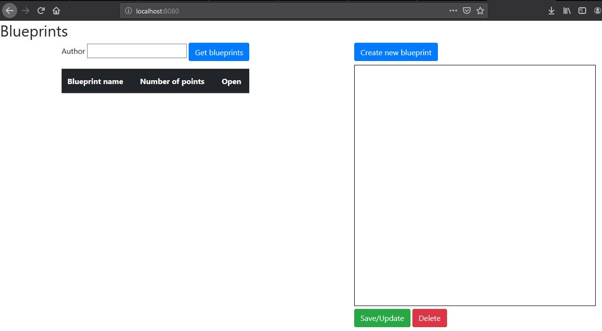
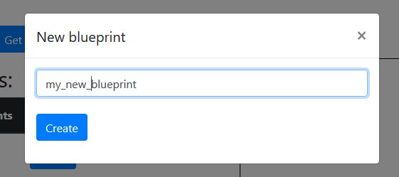
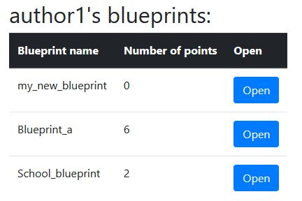
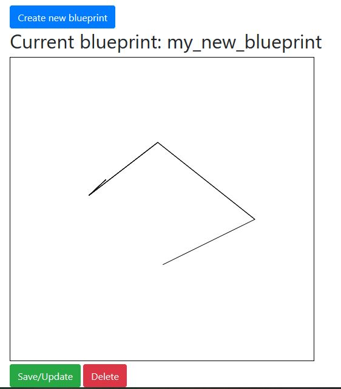
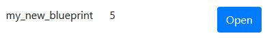
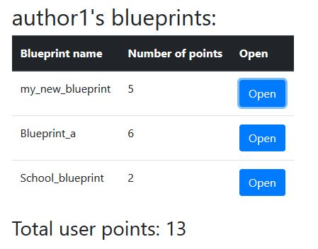
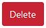
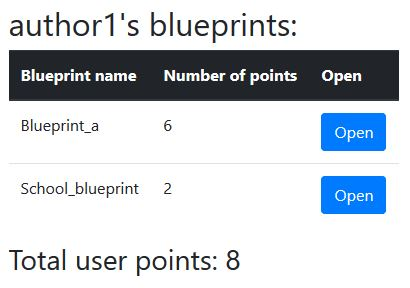

# Blueprint Management 4 - Heavy Client

## Compile and run instructions

#### Requisitos:

- Gradle
- Java

#### Ejecucción

En el directorio `BLUEPRINTS-PART1`:

- Para ejecutar el proyecto: `gradle bootRun`
- Para ejecutar las pruebas: `gradle clean build`

## Web page
La página se presenta de la siguiente manera:




## Clicks Handler
Se implementó la función `listenPointMouse` para identificar los puntos que el usuario coloque:
```javascript
var listenPointMouse = function() {
    var canvas = _getCanvas();
    var ctx = canvas.getContext("2d");
    if (window.PointerEvent) {
      canvas.addEventListener("pointerdown", function(event) {
        if (_open) {
          _repaint(event, canvas);
        }
      });
    }
  };
```

En la función `repaint` se dibuja estos nuevos puntos:
```javascript
  var _repaint = function(event, canvas) {
    var offset = _getOffset(canvas);
    var x = event.pageX - parseInt(offset.left, 10);
    var y = event.pageY - parseInt(offset.top, 10);
    var plano = _authorBlueprint.filter(obj => {
      return obj.name === _name;
    })[0];
    plano.points.push({ x: x, y: y });
    _pintar(plano);
  };
```

## Create new blueprint

Al hacer click en sobre `Create new blueprint` se presenta el siguiente modal:



Esta se agrega al autor correspondiente:



#### Implementación

Se envía a la API los nuevos puntos para que guarde o actualice.
```javascript
var savePoints = function() {
    var plano = _authorBlueprint.filter(obj => {
      return obj.name === _name;
    })[0];
    apiRest.setBlueprint(_author, _name, JSON.stringify(plano));
  };
```
En `apiclient.js` la función `setBlueprint` es:
```javascript
setBlueprint: function(author, name, newBp) {
      var putPromise = $.ajax({
        url: "/blueprints/" + author + "/" + name + "/",
        type: "PUT",
        data: newBp,
        contentType: "application/json"
      });

      putPromise.then(
        function() {
          BlueprintModule.updateListPlans(author);
          if (name) {
            BlueprintModule.openPlane(author, name);
          }
        },
        function() {
          console.info("ERROR setBlueprint");
        }
      );
```

## Save/Update blueprint
El usuario coloca nuevos puntos sobre el plano:



Cuando guarda se actualiza la cantidad total de puntos del plano:



#### Implementación
Utiliza las mismas funciones descritas anteriormente para la funcionalidad de `Create new blueprint`

## Delete blueprint
El plano a eliminar es `my_new_blueprint`:



Se realiza el click sobre el botón `Delete`:



Después de eliminar los puntos de los planos se actualizan:



#### Implementación
La función `deletePlane`:
```javascript
var deletePlane = function() {
    $("#tituloPlano").text("Current blueprint: ");
    if (_totalBlueprints > 1){
      apiRest.deletePlane(_author, _name);
    }
    else{
      alert("No se puede eliminar todos los planos");
    }
  };
```
La función `deletePlane` en `apiclient.js`:
```javascript
deletePlane: function(author, name) {
      var delPromise = $.ajax({
        url: "/blueprints/" + author + "/" + name + "/",
        type: "DELETE",
        contentType: "application/json"
      });

      delPromise.then(
        function() {
          BlueprintModule.updateListPlans(author);
          console.info("OK deletePlane");
        },
        function() {
          console.info("ERROR deletePlane");
        }
      );
    }
};
```


