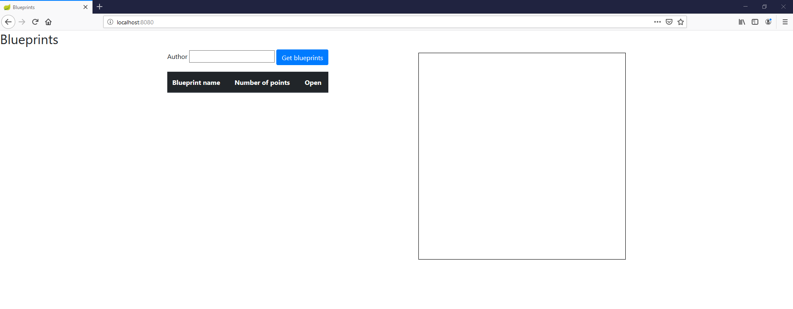
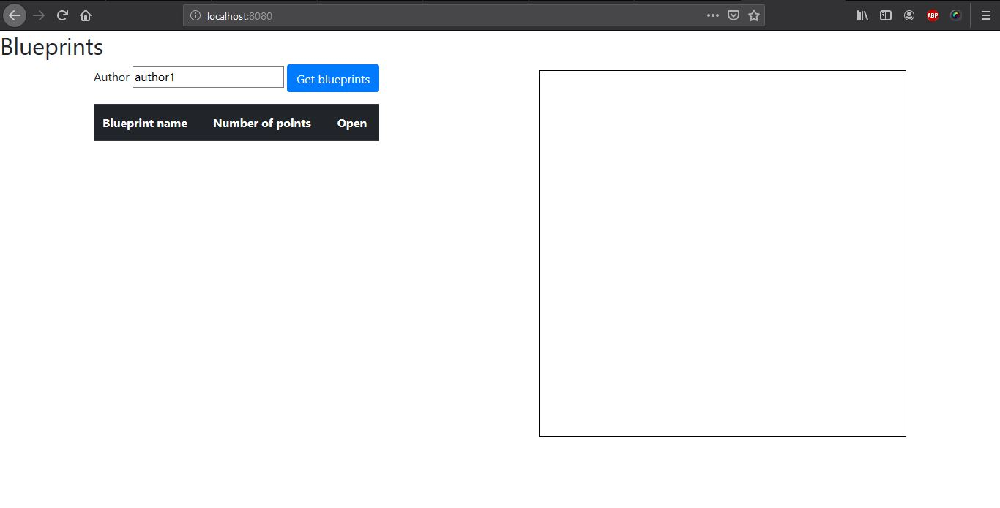
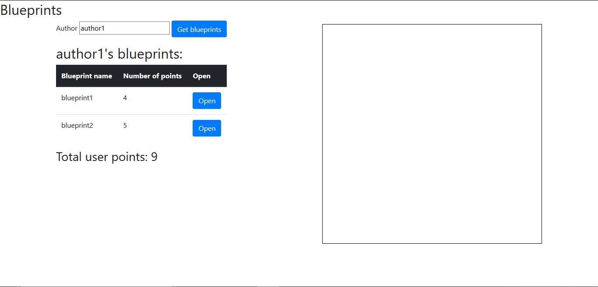
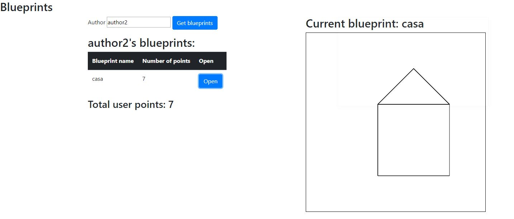
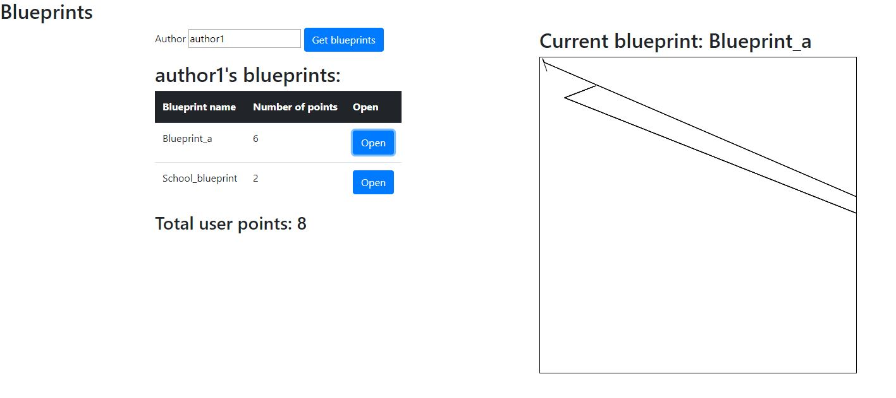

# Blueprint Management 3 - Heavy Client

## Compile and run instructions

#### Requisitos:

- Gradle
- Java

#### Ejecucción

En el directorio `BLUEPRINTS-PART1`:

- Para ejecutar el proyecto: `gradle bootRun`

## Frontend Views

Se creó la página `index.html` para la vista básica.

```html
<!DOCTYPE html>
<html>
  <head>
    <title>Blueprints</title>
    <meta charset="UTF-8" />
    <meta name="viewport" content="width=device-width, initial-scale=1.0" />

    <script src="/webjars/jquery/3.1.0/jquery.min.js"></script>
    <script src="/webjars/bootstrap/4.1.2/js/bootstrap.min.js"></script>
    <link
      rel="stylesheet"
      href="/webjars/bootstrap/4.1.2/css/bootstrap.min.css"
    />
    <script src="js/apimock.js"></script>
    <script src="js/apiclient.js"></script>
    <script src="js/app.js"></script>
  </head>

  <body>
    <h2>Blueprints</h2>
    <div class="container">
      <div style="float: left">
        <form>
          <p>
            Author <input id="author" size="20" type="text" />
            <button
              id="authBpButton"
              type="button"
              class="btn btn-primary"
              onclick="BlueprintModule.updateListPlans(author.value)"
            >
              Get blueprints
            </button>
          </p>
        </form>
        <div id="blueprintAuthorName"><h2></h2></div>
        <table id="blueprintTable" class="table">
          <thead class="thead-dark">
            <tr>
              <th>Blueprint name</th>
              <th>Number of points</th>
              <th>Open</th>
            </tr>
          </thead>
          <tbody></tbody>
        </table>
        <div id="blueprintSum"><h3></h3></div>
      </div>

      <div style="float: right">
        <h2 id="tituloPlano"></h2>
        <canvas
          id="myCanvas"
          width="500"
          height="500"
          style="border:1px solid #000000;"
        >
        </canvas>
      </div>
    </div>
  </body>
</html>
```

En el browser la página se muestra de la siguiente manera:



## Frontend Logic

Se creó el modulo que ofrece las operaciones que necesita la vista.

```javascript
var BlueprintModule = (function() {
  var _author;
  var _authorBlueprint = [];

  //métodos omitidos

  return {
    changeAuthorName: changeAuthorName,
    updateListPlans: updateListPlans
  };
})();
```

Función `map`:

```javascript
var _mapNamePoints = function(blueprints) {
  return blueprints.map(function(blueprint) {
    return { name: blueprint.name, points: blueprint.points.length };
  });
};
```

Función para generar la tabla `_genTable()`:

```javascript
var _genTable = function(blueprints) {
  blueprints = _mapNamePoints(blueprints);
  _authorBlueprint = blueprints;
  _sumPoints(blueprints);
  $("#blueprintTable > tbody").empty(); //Limpia el cuerpo de la tabla para otros datos
  blueprints.map(function(blueprint) {
    $("#blueprintTable > tbody").append(
      "<tr> <td>" +
        blueprint.name +
        "</td>" +
        "<td>" +
        blueprint.points +
        "</td>" +
        "<td><form><button type='button' class='btn btn-primary' onclick='BlueprintModule.openPlane( \"" +
        _author +
        '" , "' +
        blueprint.name +
        "\")' >Open</button></form></td>" +
        "</tr>"
    );
  });
};
```

Función para calcular el total de puntos `_sumPoints()`:

```javascript
var _sumPoints = function(blueprints) {
  var sum = blueprints.reduce(function(total, currentValue) {
    return total + currentValue.points;
  }, 0);
  $("#blueprintSum > h3").text("Total user points: " + sum);
};
```

En `index.html` se coloca en el evento `on-click` para llamar las funciones de `BlueprintModule`:

```html
<button
  id="authBpButton"
  type="button"
  class="btn btn-primary"
  onclick="BlueprintModule.updateListPlans(author.value)"
></button>
```

Las imagenes muestran el funcionamiento de los eventos:





## Next Week

Se agrego la funcion `getBlueprintsByNameAndAuthor` en _apimock.js_

```java
return {
    getBlueprintsByAuthor: function(name, callback) {
       callback(mockdata[name]);
    },
    getBlueprintsByNameAndAuthor: function(author, name, callback) {
       callback(
        mockdata[author].filter(obj => {
          return obj.name === name;
        })[0]
      );
    }
  }
```

Funcion `openPlane` en _app.js_

```java
var openPlane = function(author, name) {
    apiRest.getBlueprintsByNameAndAuthor(author, name, _pintar);
  };
```

funcion `_pintar` en _app.js_

```java
var _pintar = function(blueprint) {
    $("#tituloPlano").text("Current blueprint: " + blueprint.name);
    var c = document.getElementById("myCanvas");
    var ctx = c.getContext("2d");
    ctx.clearRect(0, 0, c.width, c.height);
    ctx.beginPath();
    var anterior;
    blueprint.points.map(function(point) {
      if (!anterior) {
        anterior = point;
        ctx.moveTo(anterior.x, anterior.y);
      } else {
        ctx.lineTo(point.x, point.y);
        ctx.stroke();
      }
    });
  };
```

Funcionamiento del boton _open_:



Creacion de la `apiclient`

```java
const apiUrl = "http://localhost:8080/blueprints/"
apiclient = (function() {

    return {
        getBlueprintsByAuthor: function(name, callback) {
            jQuery.ajax({
                url: apiUrl + name,
                success: function (result) {
                    callback(result);
                },
                async: true
            });
        },
        getBlueprintsByNameAndAuthor: function(author, name, callback) {
            jQuery.ajax({
                url: apiUrl+author+"/"+name,
                success: function (result) {
                    callback(result);
                },
                async: true
            });
        }
    };
})();
```

Funcionamiento de la `apiclient`



Variable para cambiar entre las `apiclient` y `apimock` en _app.js_

```java
var apiRest = apimock;
//Para la api client
var apiRest = apiclient;
```
